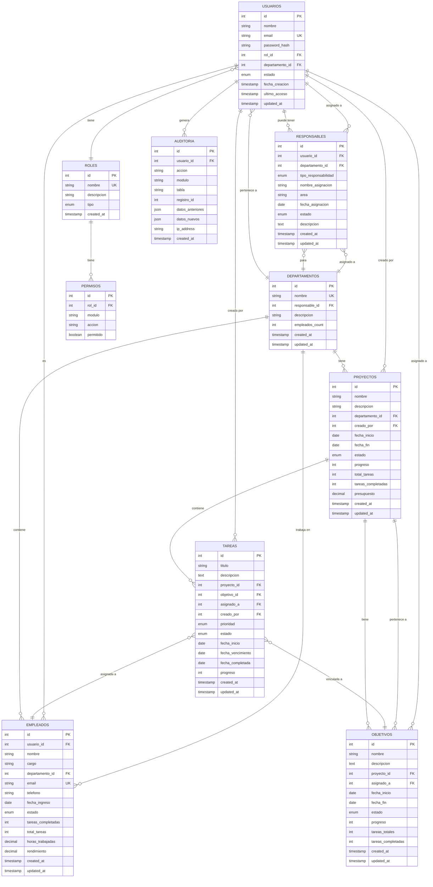

# Esquema de Base de Datos - Sistema KPI

## Diagrama Entidad-Relación (ERD)



## Descripción de Tablas

### 1. USUARIOS
Almacena la información de autenticación y perfil de los usuarios del sistema.

**Campos clave:**
- `id`: Identificador único
- `email`: Email único para login
- `password_hash`: Contraseña encriptada (bcrypt/argon2)
- `rol_id`: Relación con tabla ROLES
- `estado`: 'activo' | 'inactivo' | 'suspendido'

### 2. ROLES
Define los niveles de acceso en el sistema.

**Tipos:**
- `administrador`: Acceso completo
- `gerente`: Gestión departamental
- `lider-equipo`: Gestión de equipos
- `empleado`: Acceso básico

### 3. PERMISOS
Detalla los permisos específicos por rol.

**Estructura:**
- Permisos granulares por módulo y acción
- Ejemplo: `{rol: 'empleado', modulo: 'tareas', accion: 'crear', permitido: true}`

### 4. DEPARTAMENTOS
Estructura organizacional de la empresa.

**Características:**
- Auto-referencia al responsable (usuario)
- Contador desnormalizado de empleados para performance

### 5. EMPLEADOS
Información detallada del personal.

**Métricas incluidas:**
- Tareas completadas vs total
- Horas trabajadas
- Rendimiento calculado

### 6. PROYECTOS
Proyectos activos en la organización.

**Seguimiento:**
- Progreso en porcentaje
- Estado (planificación, en-progreso, completado, cancelado)
- Métricas de tareas

### 7. TAREAS
Unidad básica de trabajo.

**Estados:**
- `pendiente`, `en-progreso`, `en-revision`, `completada`, `cancelada`

**Prioridades:**
- `alta`, `media`, `baja`

### 8. OBJETIVOS
Metas vinculadas a proyectos.

**Características:**
- Progreso automático basado en tareas completadas
- Fechas de inicio/fin
- Asignación a usuarios responsables

### 9. RESPONSABLES
Asignaciones de responsabilidad organizacional.

**Tipos:**
- `proyecto`: Responsable de proyecto específico
- `departamento`: Jefe de departamento
- `equipo`: Líder de equipo
- `proceso`: Dueño de proceso

### 10. AUDITORIA
Registro completo de cambios en el sistema.

**Tracking:**
- Quién hizo el cambio
- Qué cambió (datos antes/después en JSON)
- Cuándo y desde dónde (IP)

## Índices Recomendados

```sql
-- Usuarios
CREATE INDEX idx_usuarios_email ON USUARIOS(email);
CREATE INDEX idx_usuarios_rol ON USUARIOS(rol_id);
CREATE INDEX idx_usuarios_departamento ON USUARIOS(departamento_id);
CREATE INDEX idx_usuarios_estado ON USUARIOS(estado);

-- Empleados
CREATE INDEX idx_empleados_departamento ON EMPLEADOS(departamento_id);
CREATE INDEX idx_empleados_estado ON EMPLEADOS(estado);
CREATE INDEX idx_empleados_usuario ON EMPLEADOS(usuario_id);

-- Proyectos
CREATE INDEX idx_proyectos_departamento ON PROYECTOS(departamento_id);
CREATE INDEX idx_proyectos_estado ON PROYECTOS(estado);
CREATE INDEX idx_proyectos_fechas ON PROYECTOS(fecha_inicio, fecha_fin);

-- Tareas
CREATE INDEX idx_tareas_proyecto ON TAREAS(proyecto_id);
CREATE INDEX idx_tareas_asignado ON TAREAS(asignado_a);
CREATE INDEX idx_tareas_estado ON TAREAS(estado);
CREATE INDEX idx_tareas_prioridad ON TAREAS(prioridad);
CREATE INDEX idx_tareas_vencimiento ON TAREAS(fecha_vencimiento);

-- Objetivos
CREATE INDEX idx_objetivos_proyecto ON OBJETIVOS(proyecto_id);
CREATE INDEX idx_objetivos_estado ON OBJETIVOS(estado);

-- Responsables
CREATE INDEX idx_responsables_usuario ON RESPONSABLES(usuario_id);
CREATE INDEX idx_responsables_tipo ON RESPONSABLES(tipo_responsabilidad);
CREATE INDEX idx_responsables_estado ON RESPONSABLES(estado);

-- Auditoría
CREATE INDEX idx_auditoria_usuario ON AUDITORIA(usuario_id);
CREATE INDEX idx_auditoria_fecha ON AUDITORIA(created_at);
CREATE INDEX idx_auditoria_modulo ON AUDITORIA(modulo);
```

## Relaciones Clave

### 1. Usuario → Empleado (1:1)
Un usuario del sistema puede tener un perfil de empleado asociado.

### 2. Departamento → Empleados (1:N)
Un departamento tiene múltiples empleados.

### 3. Proyecto → Tareas (1:N)
Un proyecto contiene múltiples tareas.

### 4. Proyecto → Objetivos (1:N)
Un proyecto tiene múltiples objetivos.

### 5. Objetivo → Tareas (1:N)
Un objetivo agrupa varias tareas relacionadas.

### 6. Usuario → Responsables (1:N)
Un usuario puede tener múltiples responsabilidades asignadas.

## Triggers Sugeridos

### 1. Actualizar contador de tareas en proyectos
```sql
CREATE TRIGGER actualizar_tareas_proyecto
AFTER INSERT OR UPDATE OR DELETE ON TAREAS
FOR EACH ROW
-- Actualizar PROYECTOS.total_tareas y tareas_completadas
```

### 2. Calcular progreso de objetivos
```sql
CREATE TRIGGER calcular_progreso_objetivo
AFTER UPDATE ON TAREAS
FOR EACH ROW
-- Actualizar OBJETIVOS.progreso basado en tareas completadas
```

### 3. Registrar auditoría automática
```sql
CREATE TRIGGER auditoria_usuarios
AFTER UPDATE ON USUARIOS
FOR EACH ROW
-- Insertar en AUDITORIA los cambios
```

### 4. Actualizar último acceso
```sql
CREATE TRIGGER actualizar_ultimo_acceso
AFTER LOGIN
-- Actualizar USUARIOS.ultimo_acceso
```

## Consideraciones de Seguridad

1. **Encriptación de contraseñas**: Usar bcrypt o Argon2
2. **SQL Injection**: Usar prepared statements
3. **Permisos de BD**: Principio de menor privilegio
4. **Auditoría**: Registrar todas las operaciones críticas
5. **Backup**: Estrategia de respaldo diario
6. **Soft Delete**: Considerar borrado lógico en lugar de físico

## Optimizaciones

1. **Desnormalización controlada**: Contadores (empleados_count, tareas_completadas)
2. **Índices compuestos**: Para consultas frecuentes
3. **Particionamiento**: Tabla de auditoría por fecha
4. **Caching**: Redis para datos de sesión y métricas
5. **Read Replicas**: Para reportes y dashboards

## Migraciones y Versionado

Usar herramientas como:
- **Flyway** (Java)
- **Liquibase** (Multi-lenguaje)
- **Alembic** (Python)
- **Knex.js** (Node.js)
- **Prisma** (TypeScript)

## Datos de Ejemplo (Seeders)

Ver archivo `database/seeds/` para datos iniciales:
- Usuario administrador por defecto
- Roles y permisos básicos
- Departamentos iniciales
- Datos de prueba para desarrollo
